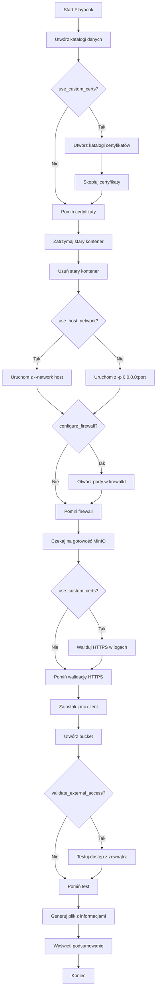

# Plan Poprawek Ansible Playbook dla MinIO

## Cel
Poprawić [`minio-playbook.yml`](minio-playbook.yml) aby automatycznie rozwiązywał problemy:
1. MinIO niedostępne spoza maszyny (porty nasłuchują tylko na localhost/wewnętrznym IP)
2. MinIO działa na HTTP mimo włączonych certyfikatów
3. Firewall blokuje dostęp z zewnątrz

---

## Zidentyfikowane Problemy w Obecnym Playbooku

### Problem 1: Niepoprawne mapowanie portów dla Podman
**Lokalizacja:** Linie 80-90 w [`minio-playbook.yml`](minio-playbook.yml:80-90)

**Obecny kod:**
```yaml
-p {{ minio_api_port }}:9000
-p {{ minio_console_port }}:9001
```

**Problem:** Podman domyślnie binduje porty tylko do localhost, nie do wszystkich interfejsów sieciowych.

**Rozwiązanie:** Dodać explicit binding do `0.0.0.0` lub użyć `--network host`

### Problem 2: Brak konfiguracji firewalld
**Problem:** Playbook nie otwiera portów w firewallu, więc nawet jeśli MinIO nasłuchuje na właściwym IP, firewall blokuje połączenia z zewnątrz.

**Rozwiązanie:** Dodać zadania Ansible do konfiguracji firewalld

### Problem 3: Brak walidacji certyfikatów
**Problem:** Playbook kopiuje certyfikaty, ale nie sprawdza czy MinIO je wykrył i czy HTTPS faktycznie działa.

**Rozwiązanie:** Dodać zadania sprawdzające logi MinIO i testujące endpoint HTTPS

### Problem 4: Brak sprawdzenia dostępności z zewnątrz
**Problem:** Playbook nie weryfikuje czy MinIO jest dostępne spoza maszyny.

**Rozwiązanie:** Dodać zadanie testujące dostęp przez rzeczywisty IP serwera

---

## Proponowane Zmiany w Playbooku

### 1. Dodanie Nowych Zmiennych

```yaml
vars:
  # Existing variables...
  
  # Network Configuration
  use_host_network: true  # Zalecane dla Podman - używa sieci hosta
  bind_to_all_interfaces: true  # Jeśli false, binduje do 0.0.0.0
  
  # Firewall Configuration
  configure_firewall: true  # Automatycznie otwiera porty w firewalld
  
  # Validation Configuration
  validate_external_access: true  # Sprawdza dostęp z zewnątrz
  server_ip: "{{ ansible_default_ipv4.address }}"  # Automatycznie wykrywa IP serwera
```

### 2. Poprawka Uruchamiania Kontenera

**Zastąpić zadanie "Start MinIO container" (linie 80-91):**

```yaml
- name: Start MinIO container with proper network configuration
  command: >
    {{ container_runtime }} run -d
    --name {{ minio_container_name }}
    
    --network host
    
    
    -p 0.0.0.0:{{ minio_api_port }}:9000
    -p 0.0.0.0:{{ minio_console_port }}:9001
    
    -p {{ minio_api_port }}:9000
    -p {{ minio_console_port }}:9001
    
    
    -e MINIO_ROOT_USER={{ minio_admin_user }}
    -e MINIO_ROOT_PASSWORD={{ minio_admin_password }}
    -v {{ minio_data_path }}:/data
    {{ minio_image }}
    server /data --console-address ":9001"
  register: container_start
```

### 3. Dodanie Konfiguracji Firewalld

**Dodać po zadaniu "Start MinIO container":**

```yaml
- name: Configure firewalld for MinIO
  block:
    - name: Check if firewalld is running
      systemd:
        name: firewalld
        state: started
      register: firewalld_status
      ignore_errors: true

    - name: Open MinIO API port in firewalld
      firewalld:
        port: "{{ minio_api_port }}/tcp"
        permanent: true
        state: enabled
        immediate: true
      when: firewalld_status is succeeded

    - name: Open MinIO Console port in firewalld
      firewalld:
        port: "{{ minio_console_port }}/tcp"
        permanent: true
        state: enabled
        immediate: true
      when: firewalld_status is succeeded

    - name: Display firewall configuration
      command: firewall-cmd --list-ports
      register: firewall_ports
      when: firewalld_status is succeeded

    - name: Show opened ports
      debug:
        msg: "Opened ports in firewall: {{ firewall_ports.stdout }}"
      when: firewalld_status is succeeded
  when: configure_firewall and ansible_os_family == "RedHat"
```

### 4. Dodanie Walidacji HTTPS

**Dodać po zadaniu "Wait for MinIO to be ready":**

```yaml
- name: Validate HTTPS configuration (if using custom certs)
  block:
    - name: Wait a moment for MinIO to load certificates
      pause:
        seconds: 5

    - name: Check MinIO logs for HTTPS
      command: "{{ container_runtime }} logs {{ minio_container_name }}"
      register: minio_logs

    - name: Verify HTTPS is enabled in logs
      assert:
        that:
          - "'https://' in minio_logs.stdout"
        fail_msg: "MinIO is not running with HTTPS despite use_custom_certs=true. Check certificate configuration."
        success_msg: "MinIO is running with HTTPS enabled."

    - name: Display MinIO endpoints from logs
      debug:
        msg: "{{ minio_logs.stdout_lines | select('search', 'API:|WebUI:') | list }}"
  when: use_custom_certs
```

### 5. Dodanie Sprawdzenia Dostępności z Zewnątrz

**Dodać przed "Generate access credentials output":**

```yaml
- name: Validate external access to MinIO
  block:
    - name: Get server IP address
      set_fact:
        server_ip: "{{ ansible_default_ipv4.address }}"

    - name: Test MinIO API accessibility from server itself
      uri:
        url: "{{ 'https' if use_custom_certs else 'http' }}://{{ server_ip }}:{{ minio_api_port }}/minio/health/live"
        method: GET
        status_code: 200
        validate_certs: false
      register: external_access_test
      retries: 3
      delay: 2

    - name: Display external access test result
      debug:
        msg: |
          ✅ MinIO is accessible from external IP: {{ server_ip }}
          API Endpoint: {{ 'https' if use_custom_certs else 'http' }}://{{ server_ip }}:{{ minio_api_port }}
          Console: {{ 'https' if use_custom_certs else 'http' }}://{{ server_ip }}:{{ minio_console_port }}
      when: external_access_test is succeeded

    - name: Warning if external access failed
      debug:
        msg: |
          ⚠️  WARNING: Cannot access MinIO from external IP {{ server_ip }}
          This might be due to:
          - Firewall blocking the ports
          - Network configuration issues
          - MinIO not binding to the correct interface
      when: external_access_test is failed
  when: validate_external_access
  ignore_errors: true
```

### 6. Aktualizacja Pliku Wyjściowego

**Zaktualizować zadanie "Generate access credentials output" (linie 125-181):**

```yaml
- name: Generate access credentials output
  copy:
    content: |
      ==========================================
      MinIO Access Information
      ==========================================
      
      Server IP: {{ server_ip | default(ansible_default_ipv4.address) }}
      Protocol: {{ 'HTTPS' if use_custom_certs else 'HTTP' }}
      
      MinIO Console URL: {{ 'https' if use_custom_certs else 'http' }}://{{ server_ip | default('localhost') }}:{{ minio_console_port }}
      MinIO API Endpoint: {{ 'https' if use_custom_certs else 'http' }}://{{ server_ip | default('localhost') }}:{{ minio_api_port }}
      
      Local Access:
      - Console: {{ 'https' if use_custom_certs else 'http' }}://localhost:{{ minio_console_port }}
      - API: {{ 'https' if use_custom_certs else 'http' }}://localhost:{{ minio_api_port }}
      
      Admin Credentials:
      ------------------
      Username: {{ minio_admin_user }}
      Password: {{ minio_admin_password }}
      
      S3 Bucket Information:
      ----------------------
      Bucket Name: {{ s3_bucket_name }}
      S3 Endpoint: {{ 'https' if use_custom_certs else 'http' }}://{{ server_ip | default('localhost') }}:{{ minio_api_port }}
      
      AWS CLI Configuration:
      ----------------------
      aws configure set aws_access_key_id {{ minio_admin_user }}
      aws configure set aws_secret_access_key {{ minio_admin_password }}
      aws configure set default.region us-east-1
      aws --endpoint-url {{ 'https' if use_custom_certs else 'http' }}://{{ server_ip | default('localhost') }}:{{ minio_api_port }} s3 ls s3://{{ s3_bucket_name }}
      
      MinIO Client (mc) Configuration:
      ---------------------------------
      mc alias set myminio {{ 'https' if use_custom_certs else 'http' }}://{{ server_ip | default('localhost') }}:{{ minio_api_port }} {{ minio_admin_user }} {{ minio_admin_password }} {{ '--insecure' if use_custom_certs else '' }}
      mc ls myminio/{{ s3_bucket_name }}
      
      Network Configuration:
      ----------------------
      Network Mode: {{ 'host' if use_host_network else 'bridge' }}
      Bind to All Interfaces: {{ bind_to_all_interfaces }}
      Firewall Configured: {{ configure_firewall }}
      
      Data Location:
      --------------
      Host Path: {{ minio_data_path }}
      Container Path: /data
      
      Certificate Configuration:
      --------------------------
      Custom Certs Enabled: {{ use_custom_certs }}
      
      CA Certificate: {{ minio_data_path }}/certs/CAs/ca.crt
      Server Certificate: {{ minio_data_path }}/certs/public.crt
      Server Key: {{ minio_data_path }}/certs/private.key
      
      
      Container Information:
      ----------------------
      Container Name: {{ minio_container_name }}
      Container Runtime: {{ container_runtime }}
      Image: {{ minio_image }}
      
      Firewall Ports:
      ---------------
      
      API Port: {{ minio_api_port }}/tcp (opened)
      Console Port: {{ minio_console_port }}/tcp (opened)
      
      Firewall configuration skipped (configure_firewall=false)
      
      
      ==========================================
      Generated: {{ ansible_date_time.iso8601 }}
      ==========================================
    dest: "{{ output_file }}"
    mode: '0644'
```

---

## Pełna Struktura Zaktualizowanego Playbooka

```
minio-playbook.yml
├── vars (zaktualizowane z nowymi zmiennymi)
├── tasks
│   ├── Ensure data directory exists
│   ├── Create MinIO certs directory (if using custom certs)
│   ├── Create MinIO CAs directory (if using custom CA)
│   ├── Copy CA certificate
│   ├── Copy MinIO certificate
│   ├── Copy MinIO private key
│   ├── Stop existing MinIO container
│   ├── Remove existing MinIO container
│   ├── Start MinIO container (POPRAWIONE - network host/0.0.0.0)
│   ├── Configure firewalld (NOWE)
│   ├── Wait for MinIO to be ready
│   ├── Validate HTTPS configuration (NOWE)
│   ├── Install MinIO client (mc)
│   ├── Configure MinIO client alias
│   ├── Create S3 bucket
│   ├── Set bucket policy
│   ├── Validate external access (NOWE)
│   ├── Generate access credentials output (ZAKTUALIZOWANE)
│   └── Display access information (ZAKTUALIZOWANE)
```

---

## Przykłady Użycia Zaktualizowanego Playbooka

### 1. Podstawowe wdrożenie z dostępem zewnętrznym (HTTP)
```bash
ansible-playbook minio-playbook.yml
```

### 2. Wdrożenie z HTTPS i certyfikatami
```bash
ansible-playbook minio-playbook.yml \
  -e "use_custom_certs=true" \
  -e "ca_cert_path=/path/to/ca.crt" \
  -e "minio_cert_path=/path/to/server.crt" \
  -e "minio_key_path=/path/to/server.key"
```

### 3. Wdrożenie bez konfiguracji firewalld
```bash
ansible-playbook minio-playbook.yml \
  -e "configure_firewall=false"
```

### 4. Wdrożenie z bridge network (zamiast host)
```bash
ansible-playbook minio-playbook.yml \
  -e "use_host_network=false" \
  -e "bind_to_all_interfaces=true"
```

---

## Diagram Przepływu Zaktualizowanego Playbooka



---

## Korzyści z Poprawek

### 1. Automatyczna Konfiguracja Sieci
- ✅ MinIO automatycznie nasłuchuje na wszystkich interfejsach
- ✅ Działa zarówno z Docker jak i Podman
- ✅ Możliwość wyboru między `--network host` a explicit binding

### 2. Automatyczna Konfiguracja Firewalld
- ✅ Porty automatycznie otwierane w firewallu
- ✅ Brak ręcznej interwencji
- ✅ Możliwość wyłączenia jeśli nie potrzeba

### 3. Walidacja Konfiguracji
- ✅ Sprawdzanie czy HTTPS faktycznie działa
- ✅ Testowanie dostępu z zewnątrz
- ✅ Jasne komunikaty o błędach

### 4. Lepsze Informacje Wyjściowe
- ✅ Plik zawiera rzeczywisty IP serwera
- ✅ Poprawne URL-e (HTTP vs HTTPS)
- ✅ Informacje o konfiguracji sieci i firewall

---

## Następne Kroki

1. ✅ Przeanalizować obecny playbook
2. ⏳ Przygotować zaktualizowaną wersję playbooka
3. ⏳ Zaktualizować README.md z nowymi zmiennymi i przykładami
4. ⏳ Przetestować playbook w środowisku testowym
5. ⏳ Wdrożyć na produkcji

---

## Czy Zatwierdzić Ten Plan?

Po zatwierdzeniu przełączę się do trybu Code i wprowadzę wszystkie poprawki do:
- [`minio-playbook.yml`](minio-playbook.yml)
- [`README.md`](README.md)